# AI CONTEXT - qgis_plugin_analyzer
Automatically generated by Ai-Context-Core

## 📁 PROJECT STRUCTURE

./
    .analyzer_state.json
    .analyzerignore
    .gitignore
    .pre-commit-hooks.yaml
    AI_CONTEXT.md
    CHANGELOG.md
    CONTRIBUTING.md
    ... (+13 more)
    src/
        .analyzer_state.json
        AI_CONTEXT.md
        PROJECT_SUMMARY.md
        __init__.py
        analysis_errors.json
        project_context.json
        analyzer/
            __init__.py
            cli.py
            engine.py
            fixer.py
            scanner.py
            semantic.py
            transformers.py
            validators.py
            rules/
                __init__.py
                modernization_rules.py
                qgis_rules.py
            utils/
                __init__.py
                ast_utils.py
                config_utils.py
                logging_utils.py
                path_utils.py
                performance_utils.py
            reporters/
                __init__.py
                html_reporter.py
                markdown_reporter.py
                summary_reporter.py
            models/
                __init__.py
                analysis_models.py
        qgis_plugin_analyzer.egg-info/
            PKG-INFO
            SOURCES.txt
            depend

## 🎯 ENTRY POINTS
- `antigravity-framerepo/scaffold/skills/data-science/examples/eda_template.py`
- `antigravity-framerepo/scaffold/skills/data-science/scripts/validate_dataset.py`
- `antigravity-framerepo/scaffold/skills/data-science/scripts/generate_mock_data.py`
- `antigravity-framerepo/bootstrap.py`
- `antigravity-framerepo/scaffold/ui/dialog_template.py`
- `.ai-context/context_manager.py`
- `antigravity-framerepo/scripts/skill_sync.py`
- `scripts/skill_sync.py`
- `src/analyzer/cli.py`
- `.ai-context/ai_workflow.py`
... and 1 more

## 🏗️ DETECTED PATTERNS
### Factory
- **AIContextManager** in `.ai-context/context_manager.py` (70%)
  - _Evidence: Method 'create_optimized_prompt' matches factory naming_
  - _Evidence: Method instantiates and returns an object_

## ⚠️ DETECTED ANTI-PATTERNS
- **antigravity-framerepo/scaffold/skills/data-science/examples/eda_template.py**
  - Magic number detected: 3
  - Magic number detected: 100
- **antigravity-framerepo/scaffold/skills/data-science/scripts/generate_mock_data.py**
  - Magic number detected: 100
  - Magic number detected: 500
- **antigravity-framerepo/bootstrap.py**
  - Magic number detected: 3
  - Magic number detected: 10
- **antigravity-framerepo/scaffold/ui/dialog_template.py**
  - Magic number detected: 400
  - Magic number detected: 15
- **.ai-context/context_manager.py**
  - Magic number detected: 4000
  - Magic number detected: 3

## 📈 COMPLEXITY AND METRICS
- **Total Modules**: 35
- **Lines of Code**: 8,798
- **Functions**: 265
- **Classes**: 30
- **Average Complexity**: 31.1
- **Avg Maintenance Index**: 39.7
- **Most Complex Modules**: .ai-context/analyze_project_optfixed.py, src/analyzer/scanner.py, .ai-context/ai_workflow.py

## 🔗 PRIMARY DEPENDENCIES
### Third Party (most frequent):
- `qgis` (14 imports)
- `utils` (14 imports)
- `ast_utils` (6 imports)
- `transformers` (5 imports)
- `validators` (5 imports)
- `path_utils` (4 imports)
- `reporters` (4 imports)
- `performance_utils` (3 imports)
- `rules` (3 imports)
- `urllib` (3 imports)
- `analysis_models` (2 imports)
- `config_utils` (2 imports)
- `dataclasses` (2 imports)
- `logging_utils` (2 imports)
- `markdown_reporter` (2 imports)

## ⚠️ UNUSED IMPORTS
- **src/analyzer/models/__init__.py**: analysis_models.ModuleAnalysis, analysis_models.ProjectContext
- **antigravity-framerepo/scripts/skill_sync.py**: os
- **scripts/skill_sync.py**: os
- **src/analyzer/reporters/__init__.py**: html_reporter.generate_html_report, markdown_reporter.generate_markdown_summary, markdown_reporter.save_json_context
- **src/analyzer/rules/__init__.py**: modernization_rules.get_modernization_rules, qgis_rules.I18N_METHODS, qgis_rules.get_qgis_audit_rules

## 🕸️  DEPENDENCY STRUCTURE
- **Nodes**: 35
- **Edges**: 0
- **Density**: 0.000

## 🕸️ DEPENDENCY DIAGRAM (Conceptual)

```mermaid
graph TD
    classDef module fill:#f9f,stroke:#333,stroke-width:2px;
    markdown_reporter
    class markdown_reporter module;
    modernization_rules
    class modernization_rules module;
    generate_mock_data
    class generate_mock_data module;
    cli
    class cli module;
    init
    class init module;
    analysis_models
    class analysis_models module;
    qgis_rules
    class qgis_rules module;
    bootstrap
    class bootstrap module;
    init
    class init module;
    context_manager
    class context_manager module;
    init
    class init module;
    init
    class init module;
    fixer
    class fixer module;
    skill_sync
    class skill_sync module;
    validate_dataset
    class validate_dataset module;
    eda_template
    class eda_template module;
    algorithm_template
    class algorithm_template module;
    dialog_template
    class dialog_template module;
    skill_sync
    class skill_sync module;
    init
    class init module;
```

## 💡 OPTIMIZATION RECOMMENDATIONS
### .ai-context/context_manager.py
- **complexity_refactoring**: Consider breaking down large logic
### src/analyzer/cli.py
- **complexity_refactoring**: Consider breaking down large logic
### src/analyzer/fixer.py
- **complexity_refactoring**: Consider breaking down large logic
### src/analyzer/reporters/markdown_reporter.py
- **complexity_refactoring**: Consider breaking down large logic
### src/analyzer/reporters/summary_reporter.py
- **complexity_refactoring**: Consider breaking down large logic

## 🔄 GIT AND EVOLUTION
### Top Hotspots:
- `src/analyzer/engine.py` (19 commits)
- `src/analyzer/scanner.py` (17 commits)
- `src/analyzer/cli.py` (15 commits)
- `src/analyzer/utils.py` (14 commits)
- `src/analyzer/reporters.py` (10 commits)
### Recent Churn (30 days):
- Total lines changed: 20915

## 🔑 PROJECT KEYWORDS
- **Technologies**: .json, .md, .py, .sample, .yaml, .0, .yml, .1