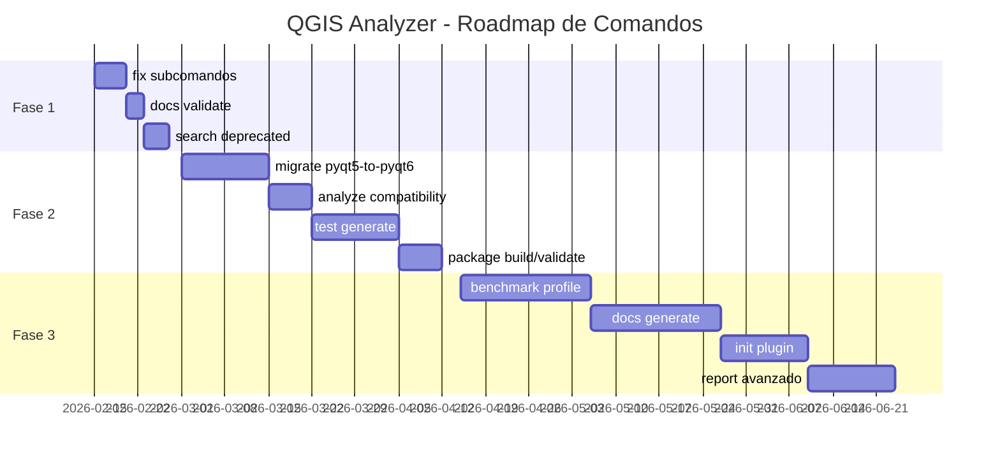

# QGIS Plugin Analyzer - Roadmap de Comandos CLI

Este documento define la estrategia de implementación de nuevos comandos y subcomandos para `qgis-analyzer`, organizada en fases basadas en valor/esfuerzo.

---

## 📊 Matriz de Priorización

| Comando/Subcomando | Valor | Esfuerzo | Fase | Prioridad |
|-------------------|-------|----------|------|-----------|
| `analyze` subcomandos | ✅ Alto | ✅ Bajo | **Completado** | - |
| `fix` subcomandos | 🔥 Alto | 🟢 Bajo | 1 | P0 |
| `docs validate` | 🔥 Alto | 🟢 Bajo | 1 | P0 |
| `search deprecated` | 🔥 Alto | 🟢 Medio | 1 | P1 |
| `analyze compatibility` | 🔥 Alto | 🟡 Medio | 2 | P1 |
| `migrate pyqt5-to-pyqt6` | 🔥 Alto | 🟡 Medio | 2 | P0 |
| `test generate` | 🟠 Medio | 🟡 Medio | 2 | P2 |
| `package build/validate` | 🟠 Medio | 🟡 Medio | 2 | P2 |
| `benchmark profile` | 🟠 Medio | 🔴 Alto | 3 | P3 |
| `docs generate` | 🟠 Medio | 🔴 Alto | 3 | P3 |
| `init plugin` | 🟡 Bajo | 🔴 Alto | 3 | P4 |
| `report` avanzado | 🟡 Bajo | 🔴 Alto | 3 | P4 |

---

## 🎯 Fase 1: Comandos de Alto Impacto (v1.9.0)

**Objetivo**: Mejorar la experiencia de desarrollo diario con comandos de corrección y validación.

**Duración estimada**: 2-3 semanas

### 1.1 `fix` con Subcomandos

**Prioridad**: P0 | **Esfuerzo**: 3-5 días

```bash
qgis-analyzer fix i18n [path]           # Auto-wrap strings en tr()
qgis-analyzer fix imports [path]        # Corrige imports (GDAL, PyQt)
qgis-analyzer fix formatting [path]     # Aplica black/isort
qgis-analyzer fix types [path]          # Agrega type hints básicos
qgis-analyzer fix all [path]            # Aplica todas las correcciones
qgis-analyzer fix --interactive [path]  # Modo interactivo con confirmación
qgis-analyzer fix --dry-run [path]      # Vista previa sin cambios
```

**Implementación**:
- [ ] Crear `FixCommand` con subparsers
- [ ] Implementar `I18nFixer` (wrapping automático)
- [ ] Implementar `ImportsFixer` (reescritura de imports)
- [ ] Implementar `FormattingFixer` (integración black/isort)
- [ ] Implementar `TypeHintsFixer` (inferencia básica)
- [ ] Modo interactivo con `rich.prompt`
- [ ] Tests de regresión para cada fixer

**Archivos afectados**:
- `src/analyzer/cli/commands/fix.py` (nuevo)
- `src/analyzer/fixers/` (nuevo paquete)
  - `base_fixer.py`
  - `i18n_fixer.py`
  - `imports_fixer.py`
  - `formatting_fixer.py`
  - `types_fixer.py`

---

### 1.2 `docs validate`

**Prioridad**: P0 | **Esfuerzo**: 2-3 días

```bash
qgis-analyzer docs validate [path]              # Valida docstrings
qgis-analyzer docs validate --style=google      # Fuerza estilo Google
qgis-analyzer docs validate --strict            # Modo estricto
qgis-analyzer docs validate --fix               # Auto-corrige formato
```

**Implementación**:
- [ ] Crear `DocsCommand` con subcomando `validate`
- [ ] Parser de docstrings (Google/NumPy/Sphinx)
- [ ] Validador de estructura (Args, Returns, Raises)
- [ ] Auto-corrección de formato
- [ ] Integración con `MetricsVisitor` existente

**Archivos afectados**:
- `src/analyzer/cli/commands/docs.py` (nuevo)
- `src/analyzer/validators/docstring_validator.py` (nuevo)
- Extensión de `MetricsVisitor`

---

### 1.3 `search deprecated`

**Prioridad**: P1 | **Esfuerzo**: 3-4 días

```bash
qgis-analyzer search deprecated [path]          # APIs deprecadas
qgis-analyzer search api "QgsVectorLayer" [path] # Uso de API específica
qgis-analyzer search pattern "*.connect(*)"     # Patrones de código
qgis-analyzer search todos [path]               # TODOs/FIXMEs/NOTEs
```

**Implementación**:
- [ ] Crear `SearchCommand`
- [ ] Base de datos de APIs deprecadas QGIS
- [ ] Motor de búsqueda AST para patrones
- [ ] Extractor de comentarios especiales
- [ ] Output formateado con contexto

**Archivos afectados**:
- `src/analyzer/cli/commands/search.py` (nuevo)
- `src/analyzer/search/` (nuevo paquete)
  - `deprecated_apis.py`
  - `pattern_matcher.py`
  - `comment_extractor.py`
- `data/deprecated_apis.json` (nuevo)

---

## 🚀 Fase 2: Migración y Compatibilidad (v2.0.0)

**Objetivo**: Facilitar migraciones entre versiones de QGIS/PyQt y mejorar testing.

**Duración estimada**: 4-6 semanas

### 2.1 `migrate pyqt5-to-pyqt6`

**Prioridad**: P0 | **Esfuerzo**: 1-2 semanas

```bash
qgis-analyzer migrate pyqt5-to-pyqt6 [path]     # Migración PyQt5 → PyQt6
qgis-analyzer migrate qgis3-to-qgis4 [path]     # Preparación QGIS 4.x
qgis-analyzer migrate python38-to-39 [path]     # Actualización Python
qgis-analyzer migrate --dry-run [path]          # Vista previa
qgis-analyzer migrate --report [path]           # Reporte de cambios
```

**Implementación**:
- [ ] Motor de transformación AST (`libcst` o `rope`)
- [ ] Reglas de migración PyQt5→PyQt6
- [ ] Reglas de migración QGIS 3→4
- [ ] Detección de cambios breaking
- [ ] Generación de reporte de migración
- [ ] Modo interactivo para decisiones

**Archivos afectados**:
- `src/analyzer/cli/commands/migrate.py` (nuevo)
- `src/analyzer/migrations/` (nuevo paquete)
  - `base_migration.py`
  - `pyqt_migration.py`
  - `qgis_migration.py`
  - `python_migration.py`
- `data/migration_rules/` (nuevos JSONs)

---

### 2.2 `analyze compatibility`

**Prioridad**: P1 | **Esfuerzo**: 1 semana

```bash
qgis-analyzer analyze compatibility [path]      # Compatibilidad general
qgis-analyzer analyze compatibility --qgis=3.28 # Versión específica
qgis-analyzer analyze compatibility --python=3.9
```

**Implementación**:
- [ ] Extender `analyze` con subcomando `compatibility`
- [ ] Matriz de compatibilidad QGIS/PyQt/Python
- [ ] Detección de APIs específicas de versión
- [ ] Validación de dependencias
- [ ] Reporte de incompatibilidades

**Archivos afectados**:
- `src/analyzer/cli/commands/analyze.py` (extensión)
- `src/analyzer/compatibility/` (nuevo paquete)
  - `version_checker.py`
  - `api_compatibility.py`
- `data/compatibility_matrix.json` (nuevo)

---

### 2.3 `test generate`

**Prioridad**: P2 | **Esfuerzo**: 1-2 semanas

```bash
qgis-analyzer test generate [path]              # Genera tests unitarios
qgis-analyzer test run [path]                   # Ejecuta tests
qgis-analyzer test coverage [path]              # Reporte de cobertura
qgis-analyzer test integration [path]           # Tests de integración
```

**Implementación**:
- [ ] Generador de tests basado en AST
- [ ] Templates de tests para QGIS
- [ ] Integración con pytest
- [ ] Runner de tests en entorno QGIS
- [ ] Reporte de cobertura

**Archivos afectados**:
- `src/analyzer/cli/commands/test.py` (nuevo)
- `src/analyzer/testing/` (nuevo paquete)
  - `test_generator.py`
  - `test_runner.py`
  - `coverage_reporter.py`
- `templates/test_templates/` (nuevos)

---

### 2.4 `package build/validate`

**Prioridad**: P2 | **Esfuerzo**: 1 semana

```bash
qgis-analyzer package build [path]              # Construye .zip
qgis-analyzer package validate [zip]            # Valida paquete
qgis-analyzer package metadata [path]           # Genera metadata.txt
qgis-analyzer package publish [zip]             # Publica a repositorio
```

**Implementación**:
- [ ] Constructor de paquetes QGIS
- [ ] Validador de estructura
- [ ] Generador de metadata.txt
- [ ] Cliente para repositorios QGIS
- [ ] Validación de firma digital

**Archivos afectados**:
- `src/analyzer/cli/commands/package.py` (nuevo)
- `src/analyzer/packaging/` (nuevo paquete)
  - `builder.py`
  - `validator.py`
  - `metadata_generator.py`
  - `publisher.py`

---

## 🔬 Fase 3: Análisis Avanzado (v2.5.0)

**Objetivo**: Herramientas avanzadas de profiling, documentación y scaffolding.

**Duración estimada**: 6-8 semanas

### 3.1 `benchmark profile`

**Prioridad**: P3 | **Esfuerzo**: 2-3 semanas

```bash
qgis-analyzer benchmark profile [path]          # Profiling de funciones
qgis-analyzer benchmark memory [path]           # Análisis de memoria
qgis-analyzer benchmark startup [path]          # Tiempo de carga
qgis-analyzer benchmark compare [v1] [v2]       # Comparación
```

**Implementación**:
- [ ] Integración con `cProfile`/`line_profiler`
- [ ] Análisis de memoria con `memory_profiler`
- [ ] Benchmarking de startup
- [ ] Comparación entre versiones
- [ ] Visualización de resultados

**Archivos afectados**:
- `src/analyzer/cli/commands/benchmark.py` (nuevo)
- `src/analyzer/benchmarking/` (nuevo paquete)
  - `profiler.py`
  - `memory_analyzer.py`
  - `comparator.py`

---

### 3.2 `docs generate`

**Prioridad**: P3 | **Esfuerzo**: 2-3 semanas

```bash
qgis-analyzer docs generate [path]              # Genera documentación
qgis-analyzer docs export --format=html         # Exporta a HTML/PDF
qgis-analyzer docs i18n [path]                  # Extrae strings
qgis-analyzer docs serve [path]                 # Servidor local
```

**Implementación**:
- [ ] Generador de documentación API
- [ ] Integración con Sphinx/MkDocs
- [ ] Extractor de strings traducibles
- [ ] Servidor de documentación local
- [ ] Exportación a múltiples formatos

**Archivos afectados**:
- `src/analyzer/cli/commands/docs.py` (extensión)
- `src/analyzer/documentation/` (nuevo paquete)
  - `generator.py`
  - `exporter.py`
  - `i18n_extractor.py`
  - `server.py`

---

### 3.3 `init plugin`

**Prioridad**: P4 | **Esfuerzo**: 2 semanas

```bash
qgis-analyzer init plugin [name]                # Scaffold completo
qgis-analyzer init processing [name]            # Algoritmo processing
qgis-analyzer init tests [path]                 # Estructura de tests
qgis-analyzer init ci [path]                    # Configuración CI/CD
qgis-analyzer init --template=modern            # Templates
```

**Implementación**:
- [ ] Sistema de templates (Jinja2)
- [ ] Scaffolding de plugin completo
- [ ] Generador de algoritmos Processing
- [ ] Configuración CI/CD (GitHub Actions)
- [ ] Templates modernos y legacy

**Archivos afectados**:
- `src/analyzer/cli/commands/init.py` (extensión)
- `src/analyzer/scaffolding/` (nuevo paquete)
  - `template_engine.py`
  - `plugin_generator.py`
  - `ci_generator.py`
- `templates/plugin_templates/` (nuevos)

---

### 3.4 `report` Avanzado

**Prioridad**: P4 | **Esfuerzo**: 1-2 semanas

```bash
qgis-analyzer report quality [path]             # Reporte de calidad
qgis-analyzer report security [path]            # Reporte de seguridad
qgis-analyzer report compliance [path]          # Cumplimiento QGIS
qgis-analyzer report --format=pdf               # Exportar a PDF
qgis-analyzer report --dashboard                # Dashboard interactivo
```

**Implementación**:
- [ ] Generador de reportes avanzados
- [ ] Exportación a PDF (WeasyPrint)
- [ ] Dashboard interactivo (Streamlit/Dash)
- [ ] Gráficos y visualizaciones
- [ ] Reportes comparativos

**Archivos afectados**:
- `src/analyzer/cli/commands/report.py` (nuevo)
- `src/analyzer/reporting/` (extensión)
  - `advanced_reporter.py`
  - `pdf_exporter.py`
  - `dashboard.py`

---

## 🌟 Características Transversales

Estas mejoras se aplicarán a **todos** los comandos de forma incremental:

### Fase 1 (v1.9.0)
- [ ] `--json` output para todos los comandos
- [ ] `--config` file support (TOML/YAML)
- [ ] Logging mejorado con `rich`
- [ ] Progress bars consistentes

### Fase 2 (v2.0.0)
- [ ] `--watch` mode (análisis continuo)
- [ ] `--cache` (resultados incrementales)
- [ ] `--parallel` (control de workers)
- [ ] `--exclude`/`--include` patterns avanzados

### Fase 3 (v2.5.0)
- [ ] Plugin system para extensiones
- [ ] API pública para integraciones
- [ ] Telemetría opcional (opt-in)
- [ ] Auto-actualización

---

## 📋 Dependencias Nuevas

### Fase 1
- `black` - Formateo de código
- `isort` - Ordenamiento de imports
- `rich` - UI mejorada en terminal

### Fase 2
- `libcst` o `rope` - Transformaciones AST
- `pytest` - Testing framework
- `coverage` - Cobertura de tests

### Fase 3
- `cProfile`, `line_profiler` - Profiling
- `memory_profiler` - Análisis de memoria
- `sphinx` o `mkdocs` - Generación de docs
- `jinja2` - Templates
- `weasyprint` - Exportación PDF
- `streamlit` - Dashboard interactivo

---

## 🎯 Métricas de Éxito

### Fase 1
- [ ] 80% de issues `MISSING_I18N` auto-corregibles
- [ ] 90% de imports incorrectos detectados y corregidos
- [ ] Tiempo de validación de docstrings < 5s para proyectos medianos

### Fase 2
- [ ] 95% de migraciones PyQt5→PyQt6 exitosas sin intervención
- [ ] Cobertura de tests generados > 60%
- [ ] Paquetes validados 100% compatibles con repositorio QGIS

### Fase 3
- [ ] Identificación de cuellos de botella en < 1 minuto
- [ ] Documentación generada lista para publicación
- [ ] Plugins scaffolded funcionando sin modificaciones

---

## 📅 Timeline Estimado



---

## 🔄 Proceso de Implementación

Para cada comando/subcomando:

1. **Diseño** (1-2 días)
   - Especificación de CLI
   - Diseño de arquitectura
   - Definición de tests

2. **Implementación** (según esfuerzo)
   - Código base
   - Tests unitarios
   - Documentación inline

3. **Testing** (1-2 días)
   - Tests de integración
   - Testing manual
   - Validación con plugins reales

4. **Documentación** (1 día)
   - README actualizado
   - Ejemplos de uso
   - CHANGELOG

5. **Release** (1 día)
   - Tag de versión
   - Publicación a PyPI
   - Anuncio en comunidad

---

## 📝 Notas de Implementación

- Todos los comandos deben seguir el patrón establecido en `BaseCommand`
- Mantener compatibilidad hacia atrás en cada release
- Documentar breaking changes claramente
- Incluir tests de regresión para cada feature
- Usar type hints en todo el código nuevo
- Seguir Google docstring style

---

**Última actualización**: 2026-02-14
**Versión actual**: 1.8.0-beta.1
**Próximo release**: 1.9.0 (Fase 1)
